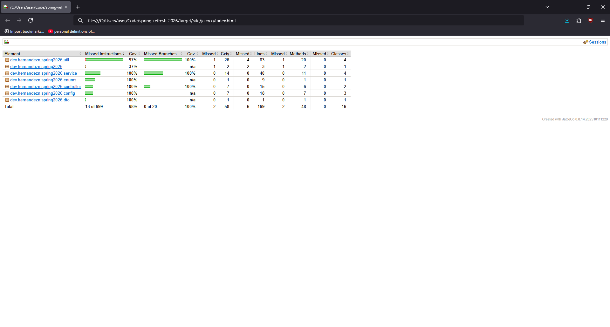
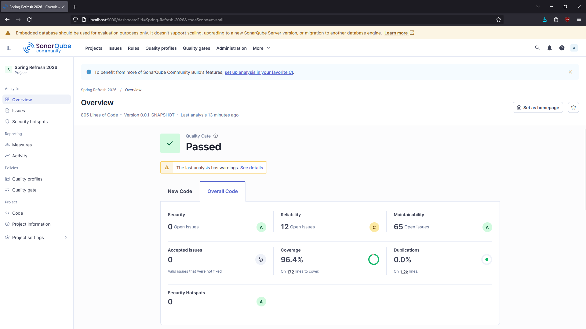

# Spring Refresh (2026)
This is a local Spring Boot RESTful Web API server, for my own experimentation & knowledge review.

It's meant as a coding sandbox for my upcoming projects & practice with the technology, not as a live deployed Web service. Some enterprise practices (like logging & high unit test coverage) are applied for practice & reference.

Resources being referenced:
- [Spring Boot official guides](https://spring.io/guides)
- [Selenium Webdriver documentation](https://www.selenium.dev/documentation/webdriver/)
- [Maven Repository](https://mvnrepository.com/)
- [Client Engagement Portal (from previous work)](https://github.com/revaturelabs/client-engagement-portal-back)

# Custom Features

- **Website Screenshotter API**

  The GET API endpoint at "/screenshot?url=\[URL]" will create and serve a live screenshot of the URL provided. This API is powered by Selenium Webdriver, and it's provided with thread safety using Java's ExecutorService, to provide an internal task queue for screenshots.

- **Uptime Captor & Request Captor**

  Inspired by IIoT uptime tracking. This captures server uptimes & API requests and persists them in a local database.
  - Uptime database entries capture startup & shutdown times, along with whether there was an abnormal shutdown (captured via a shutdown code & lookup table).
  - Every request entry has the path it targets, the time of the request, the HTTP method used, and a foreign key to its uptime window's entry.
  - I've also set up normal to-file logging using Log4J, but this is extraneous to / in addition to these database-captured custom traceability features.

# High-level Architecture & Dependencies

- **Layered REST API via MVC Components**

  API requests arrive at an MVC controller, then data travels through a Service layer & Repository layer to carry out database communication via Entity models. Response JSONs are DTO models. HTML views are fully servable. One custom view is served (on the root path, http://localhost:9012/) for checking API endpoints at a glance, with API data displayed in this view using JavaScript fetch & DOM manipulation.

- **Unit Testing & Slice Testing with JUnit & Mockito**

  Unit tests are performed across the application. *The Controller and Repository layers additionally have @WebMvcTest and @DataJpaTest, respectively, to perform <ins>slice testing / partial integration testing</ins>*, for checking HTTP response outputs and database-persisted record outputs.

- **Selenium Webdriver**

  Runs an internal Web browser to carry out automation tasks that require rendering Web pages.

- **Swagger UI with Spring OpenAPI**

  Serves an API documentation page at [/swagger-ui.html](http://localhost:9012/swagger-ui/index.html). API endpoints in the service have Swagger operation annotations, to detail information about API endpoints in Swagger.

- **Spring Data JPA**

  JPA repositories & annotation-configured Entity mappings carry out database interfacing.

- **JaCoCo Test Coverage Reporting Tool**

  When run using the Maven Test or Maven Verify step, the application generates a test coverage report. Here's a report generated by JaCoCo within this application:
  <details>
    <summary>
      📊 <ins>JaCoCo test coverage report from April 13, 2026</ins>
    </summary>

    
  </details>
  
- **Sonar Code Quality Tool**

  Using a locally run server instance of [SonarQube](https://www.sonarsource.com/open-source-editions/sonarqube-community-edition/), the application generates a code quality report that a developer can use to improve application security, reliability, and maintainability.
  
  <details>
    <summary>
      📊 <ins>Sonar code quality report from April 22, 2026</ins>
    </summary>

    
  </details>

- **Maven, Apache Tomcat, Java 21, application config**

  Baseline dependencies for the project. Dependency management through a Maven pom.xml, run configuration through application.properties (may switch to application.yaml), running an embedded Apache Tomcat server, built using Java 21 (highest LTS Java version with full out-of-the-box support from Lombok at the time of creation).

# How to Run Locally via Terminal

Running this project requires [Java](https://www.oracle.com/java/technologies/downloads/#java21) and [Apache Maven](https://maven.apache.org/download.cgi).

Once this project is in your local system, open a command line to the folder containing this project, and run the following command:
```
   mvn spring-boot:run
```

---

Once the server is running, these pages will be available in a Web browser:

- [localhost:9012](http://localhost:9012/) - a simple static UI, currently being used to check API endpoint responses at a glance.
- [localhost:9012/h2-console](http://localhost:9012/h2-console) - a UI for the local database run by the application. If the login form isn't pre-filled, provide these values:
  - Driver Class: `org.h2.Driver`
  - JDBC URL: `jdbc:h2:./data/localdb`
  - User Name: `sa`
  - Password: (leave this field blank)
- [localhost:9012/swagger-ui.html](http://localhost:9012/swagger-ui/index.html) - Swagger UI, API documentation tool

---

Test coverage reporting is available, powered by JaCoCo. To generate the report, use the following command from the project's root directory:

```
  mvn test
```

The project will create a test coverage report, viewable in any Web browser, under the project directory at: `spring-refresh-2026/target/site/jacoco/index.html`


